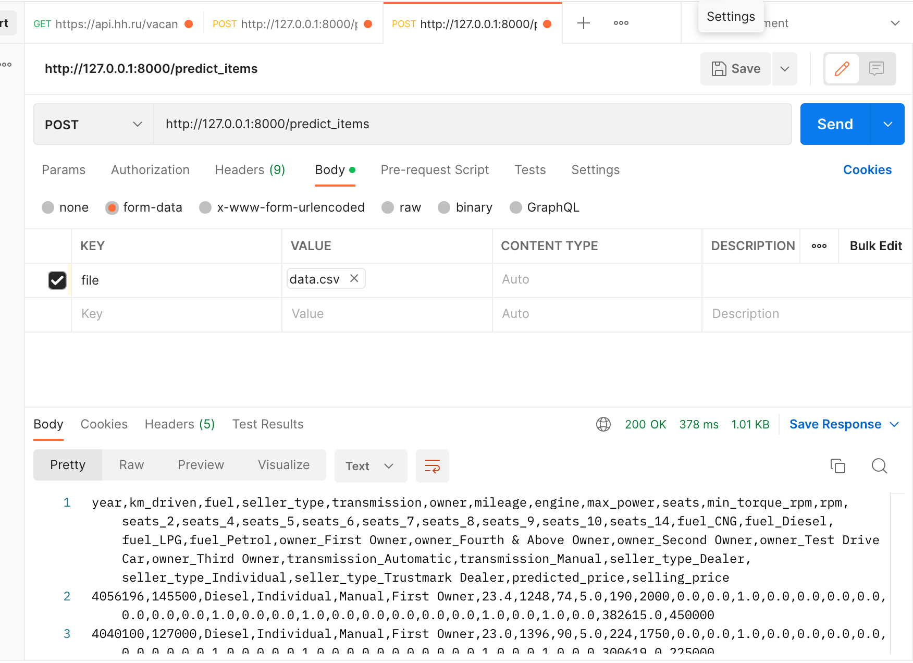
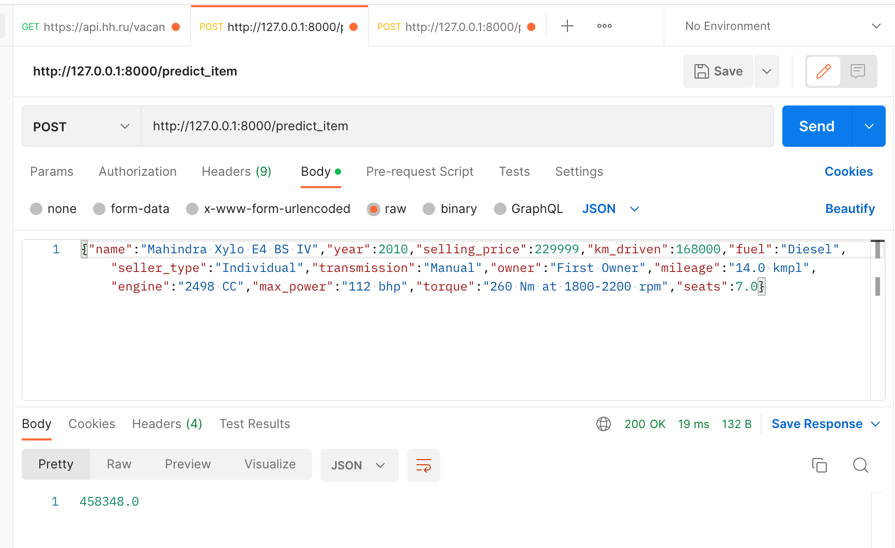

# Домашнее задание ML часть 1 - Роман Белый
Разработка модели для предсказания цены автомобиля и установка модели в FastAPI сервис

## Итак, что было сделано :-):
### Данные
 - Проанализировал данные объектов в тренировочнои и тестовом наборе. Убрал дубликаты для одинаковы записей где все признаки одинаковые без учета цены автомобиля (при этом сохранив только первый признак)
 - Заполнил пропуски в numeric столбцах медианными значениями (что было не сложно)
 - Долго изучал колонку крутящий момент и пришел к выводу что ее можно разделить на две части с учетом единиц измерения (надо умножать на 9.8 Kgm -> nNm https://convert-units.info/torque/kilogram-force-meter/9.8 ) если крутящий момент меньше чем ~51 (подсмотрел распределение крутящего момента для 20 наиболее популярных двигателей "https://www.researchgate.net/figure/The-raw-data-set-for-20-automobile-engines-Torque-versus-RPM_fig1_264228339" и заметил что там он минимально равен 90). Для разделения использовал regexp хотя сначала написал решение без него но оно было невероятно громоздкое и его пришлось переписать когда уже дошел до переноса в сервис :-(
 - Очистил оставшиеся колонки и закодировал все методом One Hot. Первое решение было сделано через dummy но потом пришлось переделать так как не удалось объединить все колонки с тренировочного и тестового датасета (stackoverflow показал варианты но опять же было неудобно использовать в сервисе)
 - проанализировал данные заметил несколько выбросов в мощности, моменте и цене и убрал их через 10 персентиль и так же  выполнил нормализацию значение через StandardScaler.
 - написал функцию которая заменяет бренд авто на марку (так как BMW дороже Hyndai) и думаю этот признак должен был бы помогать модели 
 - **Итого: получился дата сет с 35-ю колонками (нормализованный с разделением по моменту, без пропусков (заполнил средним) и дубликатов -> готовый к тренировке)**

### Модель
 - Первая тренировка модели с помощью линейной регрессии показала не очень хороший результат ~0.57 R2 (MSE была 5ти значной)
 - Использование elastic/lasso модели на тех же данных не сильно улучшило результат (±0.1)
 - Нормализация данных принесла дополнительные 0.5 и R2 метрика стала >0.62 на тренировочном дата сете
 - One Hot кодирование категориальных признаком принесло еще около 0.5 и R2 метрика улучшилась до >0.67 для тестового
  - - результат был похожим для всех трех типов моделей (lasso/elastic/ridge)
  - наибольший прирост метрики R2 дали следующие шаги:
  - - возвести год в квадрат так как было подсказано что зависимость между годом и ценой квадратичная
  - - прологарифмировать цену десятичным логарифмом
  - **Итого: Самый высокий R2 оказался для модели ridge с логарифмом по ценее и квадратом года на закодированных категориальных признаках но без нормализации данных. R2 на тренировочной выборке  -> R2 Test : 0.8716779549143503**

### Сервис
 - Сложностей не было но пришлось создать несколько функция так как логика и код и ноутбука не подходил )) 

### Screenshots

### Что не попробовал или не получилось
 - разбиение torque было самым затратным по времени и не принесло ощутимой выгоды для модели :-( поэтому плохо что быстро это понять не получилось
 - не успел попробовать закодировать через one hot бренды/модели
 - не успел попробовать поиграть с лошадиными силами 
 - можно было лучше почистить данные и мне кажется там еще остались outliners

###
 
# 😀 The End
